# 🛡️ BCP SOC - Análisis de Tráfico Web y Detección de Amenazas en Banca por Internet

## 📑 Tabla de Contenidos
1. [Contexto del Negocio](#contexto-del-negocio)
2. [Rol y Objetivo](#rol-y-objetivo)
3. [Stack Tecnológico](#stack-tecnológico)
4. [Sobre los Datos y Limpieza](#sobre-los-datos)
5. [Estructura de la Base de Datos](#estructura-de-la-base-de-datos)
6. [Tareas (Task) / Preguntas de Negocio](#tareas-task--preguntas-de-negocio)
7. [Análisis Exploratorio e Insights (15 Preguntas)](#análisis-exploratorio-de-datos-eda-e-insights)
8. [Conclusiones Generales](#conclusiones-generales)

## 📌 Contexto del Negocio
En el último trimestre, la gerencia de Ciberseguridad del BCP ha detectado problemas críticos que impactan la disponibilidad de la Banca por Internet: un incremento del 40% en reclamos por *Account Takeover* (robo de credenciales web) y caídas intermitentes en la plataforma debido a picos masivos de peticiones anómalas en los servidores de autenticación.

## 🎯 Rol y Objetivo
Asumiendo el rol de **Data Analyst en el equipo defensivo (Blue Team) del SOC del BCP**, el objetivo de este proyecto es auditar registros históricos de la API, detectar patrones de ataques automatizados que lograron evadir las primeras capas del firewall y proponer reglas de mitigación basadas en datos (Blacklists y umbrales de bloqueo).

## 🛠️ Stack Tecnológico
*   **Motor de Base de Datos:** SQL Server
*   **Lenguaje:** T-SQL
*   **Entorno:** SQL Server Management Studio (SSMS)
*   **Limpieza de datos:** Python (Librerías -> pandas / numpy)


## 📚 Sobre los datos
Los datos originales, junto con el diccionario de variables, se pueden encontrar en [Kaggle](https://www.kaggle.com/datasets/teamincribo/cyber-security-attacks?resource=download).

El conjunto de datos incluye métricas de tráfico de red e indicadores de amenazas que capturan información como direcciones IP, protocolos de comunicación, firmas de ataque, puntuaciones de anomalías y acciones tomadas. Toda esta información está distribuida en 40,000 registros y 25 columnas, abarcando narrativas de ciberseguridad desde enero de 2020 hasta octubre de 2023.


## 🧹 Limpieza y Transformación de Datos
Antes de la ingesta en SQL Server, el archivo plano original ([`cybersecurity_attacks.csv`](./data/raw/cybersecurity_attacks.csv)) pasó por un proceso de preparación mediante un script de Python ([`clean_data.py`](./scripts/clean_data.py)), asegurando la calidad de la información y adaptándola al contexto local del negocio:

* **Tratamiento de Nulos:** Se identificaron valores ausentes en columnas operativas clave (`Malware Indicators`, `Alerts/Warnings`, `Proxy Information`, `Firewall Logs`, `IDS/IPS Alerts`) y se estandarizaron bajo la etiqueta *"No Detectado"* para optimizar las consultas condicionales en T-SQL.
* **Formateo Temporal:** La columna `Timestamp` se transformó estrictamente al formato `YYYY-MM-DD HH:MM:SS` para garantizar la compatibilidad nativa con el tipo de dato `DATETIME`.
* **Contextualización Geográfica:** Se eliminó la columna original `Geo-location Data` y se reemplazó por dos nuevas dimensiones (`City` y `Region`). Para simular de forma realista el tráfico local, se distribuyeron de manera congruente ubicaciones peruanas (como Lima, Arequipa y Chiclayo).
* **Anonimización y Contextualización de Usuarios:** Se reemplazaron los datos originales de la columna `User Information` por combinaciones aleatorias de nombres y apellidos comunes en Perú, alineando el dataset con la demografía de los clientes del BCP.
* **Arquitectura de Red Bancaria:** Se mapearon los valores genéricos de la columna `Network Segment` (Segment A, B, C) hacia zonas de seguridad reales de la arquitectura del banco: *DMZ*, *Internal Core* y *Corporate Network*, permitiendo un análisis de penetración más preciso.
* **Generación del Dataset Estructurado:** Como resultado de estas transformaciones, se exportó un nuevo archivo limpio ([`cybersecurity_peru_cleaned.csv`](./data/processed/cybersecurity_peru_cleaned.csv)) con 26 columnas, completamente listo para su importación y normalización en la base de datos relacional.


## 🗃️ Estructura de la Base de Datos
El dataset limpio ([`cybersecurity_peru_cleaned.csv`](./data/processed/cybersecurity_peru_cleaned.csv)) fue normalizado bajo un **Modelo Estrella** en SQL Server para optimizar las consultas analíticas. El esquema se divide en tres tablas de dimensión y una tabla de hechos central:

* **`Dim_Usuarios`**: Almacena la información de los clientes del banco (nombres anonimizados).
* **`Dim_Dispositivos_Red`**: Contiene los orígenes del tráfico, incluyendo la IP de origen, tipo de dispositivo, geolocalización (Ciudad y Región) y el segmento de red bancaria (`DMZ`, `Internal Core`, `Corporate Network`).
* **`Dim_Amenazas`**: Catálogo único de vectores de ataque, firmas de malware, indicadores de compromiso (IoC) y niveles de severidad.
* **`Fact_Trafico_Web`**: Tabla transaccional (Hechos) que registra cada evento de red a nivel de milisegundo, uniendo las dimensiones y almacenando métricas cuantitativas como puertos, protocolos, longitud de paquetes, *Anomaly Scores* y las acciones tomadas por el firewall.

**Diagrama Entidad-Relación (DER):**
> 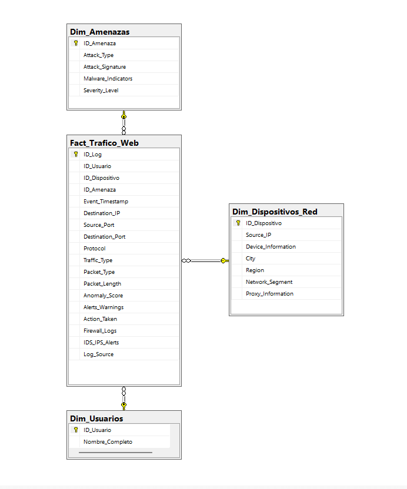
> *(Diagrama generado desde SQL Server Management Studio)*


## 📋 Tareas (Task) / Preguntas de Negocio

A raíz de los incidentes recientes de *Account Takeover* y las caídas en los servidores, la Gerencia de Ciberseguridad convocó un comité de evaluación. Para entender exactamente cómo los atacantes están operando y fortalecer las defensas del banco, han solicitado a nuestro equipo (SOC - Blue Team) una auditoría forense profunda sobre la telemetría de red.

Para guiar este análisis, la gerencia ha definido **15 directrices críticas** que debemos resolver explotando la base de datos con SQL. Responder a estas interrogantes nos permitirá mapear la superficie de ataque y proponer nuevas reglas de bloqueo automatizadas:

1. **Top Orígenes (Ciudades):** ¿Cuáles son las 5 ciudades peruanas desde donde se origina la mayor cantidad de ataques contra la Banca por Internet?
2. **Evasión de Firewall (Brechas Críticas):** ¿Qué porcentaje del tráfico clasificado con severidad "Alta" logró evadir los controles de seguridad y fue catalogado como ignorado (`Action_Taken = 'Ignored'`)?
3. **Penetración por Segmento de Red:** ¿Qué volumen de ataques de tipo "Malware" logró alcanzar el segmento crítico *Internal Core* en comparación con los mitigados en la *DMZ*?
4. **Horarios de Mayor Riesgo:** ¿Cuáles son las horas del día (madrugada vs. horario de oficina) que concentran el mayor volumen de peticiones anómalas en los servidores de autenticación?
5. **Anomalías Geográficas:** ¿Desde qué regiones específicas del Perú se originan los picos más altos en las puntuaciones de anomalía (*Anomaly Scores*)?
6. **Vectores de Ataque Frecuentes:** ¿Cuáles son las 3 firmas de ataque (`Attack_Signature`) más utilizadas por los cibercriminales para intentar vulnerar el sistema del BCP?
7. **Vulnerabilidad por Dispositivo:** ¿Qué perfiles de agentes de usuario (`Device_Information`) han detonado la mayor cantidad de alertas críticas del sistema IDS/IPS?
8. **Efectividad del Proxy y Bloqueos:** ¿Cuál es la tasa de éxito del firewall (`Action_Taken = 'Blocked'`) al enfrentar tráfico oculto detrás de Proxies en comparación con conexiones directas?
9. **Análisis de Protocolos:** ¿Qué protocolo de comunicación está mayormente asociado a los ataques de denegación de servicio (DDoS) que buscan generar caídas intermitentes en la banca por internet?
10. **Amenazas Internas (Insider Threats):** ¿Qué porcentaje de las alertas de seguridad se originan de manera inusual dentro de la red interna de empleados (*Corporate Network*)?
11. **Indicadores de Compromiso (IoC):** ¿Cuáles son los indicadores de malware (`Malware_Indicators`) más detectados en los ataques que lograron infiltrarse exitosamente?
12. **Correlación de Severidad:** ¿Cuál es el promedio matemático del *Anomaly Score* dependiendo de si el nivel de severidad de la amenaza es Bajo, Medio o Alto?
13. **Tipos de Tráfico Sospechoso:** ¿Existe algún tipo de tráfico web (`Traffic_Type`) que esté recurrentemente vinculado a intentos de intrusión que terminan siendo bloqueados?
14. **Carga de Tráfico Malicioso:** ¿Existe una diferencia significativa en la longitud promedio de los paquetes de datos (`Packet_Length`) entre el tráfico bloqueado y el tráfico permitido?
15. **Eficacia de las Capas Defensivas:** ¿Cómo se compara el volumen total de amenazas detectadas y detenidas por el Firewall de perímetro frente a las detenidas por el sistema IDS/IPS interno?

---

## 📊 Análisis Exploratorio de Datos (EDA) e Insights

A continuación, se detalla la ejecución de las consultas SQL diseñadas para responder a los requerimientos de la gerencia. Cada hallazgo está acompañado del razonamiento técnico detrás de la consulta, los resultados obtenidos y la recomendación estratégica para el negocio.

### Pregunta #1: ¿Cuáles son las 5 ciudades peruanas desde donde se origina la mayor cantidad de ataques contra la Banca por Internet?

Debido a que los atacantes utilizan redes de bots (botnets) que rotan constantemente de dirección IP para evadir bloqueos individuales, el análisis se centró en identificar los clústeres geográficos. Utilicé `COUNT()` y `TOP 5` agrupando por las dimensiones de `City` y `Region`.

```sql
-- Top 5 Ciudades con mayor cantidad de ataques registrados
SELECT TOP 5
    d.City,
    d.Region,
    COUNT(f.ID_Log) AS Total_Ataques
FROM Fact_Trafico_Web f
JOIN Dim_Dispositivos_Red d ON f.ID_Dispositivo = d.ID_Dispositivo
GROUP BY 
    d.City,
    d.Region
ORDER BY 
    Total_Ataques DESC;
```

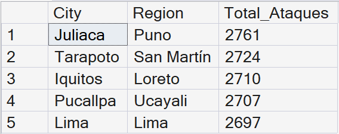

**💡 Insight:**
Juliaca (2,761 ataques) lidera inusualmente el volumen de tráfico malicioso, superando a la capital, Lima (2,697). Esto sugiere fuertemente la presencia de redes de bots (botnets) focalizadas operando desde provincias.

**🛠️ Acción de Mitigación:** Escalar al proveedor de internet (ISP) para aplicar políticas de *Rate-Limiting* y limpieza de red (*Scrubbing*) restrictivas sobre los bloques IP de estas 5 ciudades.


### Pregunta #2: ¿Qué porcentaje del tráfico clasificado con severidad "Alta" logró evadir los controles de seguridad y fue catalogado como ignorado (`Action_Taken = 'Ignored'`)?

Utilicé una declaración `CASE` dentro de una función de agregación `SUM()` para contabilizar los registros "Ignorados", dividiéndolos por el total de registros de alta severidad. La función `ROUND()` se empleó para formatear el porcentaje a dos decimales.

```sql
-- Porcentaje de evasión para amenazas de Severidad Alta
SELECT 
    COUNT(f.ID_Log) AS Total_Amenazas_Altas,
    SUM(CASE WHEN f.Action_Taken = 'Ignored' THEN 1 ELSE 0 END) AS Amenazas_Evadidas,
    ROUND(SUM(CASE WHEN f.Action_Taken = 'Ignored' THEN 1 ELSE 0 END) * 100.0 / COUNT(f.ID_Log), 2) AS Porcentaje_Evasion
FROM Fact_Trafico_Web f
JOIN Dim_Amenazas a ON f.ID_Amenaza = a.ID_Amenaza
WHERE a.Severity_Level = 'High';
```

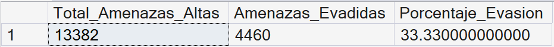

**💡 Insight:**
Un alarmante 33.33% (4,460) de los ataques clasificados con severidad "Alta" logran evadir el firewall perimetral y son catalogados como ignorados. 

**🛠️ Acción de Mitigación:** Auditar y actualizar de urgencia las reglas de filtrado de paquetes del firewall, ya que las firmas actuales están resultando ineficaces ante 1 de cada 3 ataques críticos.


### Pregunta #3: ¿Qué volumen de ataques de tipo "Malware" logró alcanzar el segmento crítico Internal Core en comparación con los mitigados en la DMZ?

Agrupé el recuento de eventos `(COUNT)` por la columna `Network_Segment` de la tabla de dimensiones. Apliqué la cláusula `WHERE` para aislar el `Attack_Type` clasificado como "Malware", excluyendo la red corporativa.

```sql
-- Distribución de penetración de Malware por segmento de red
SELECT 
    d.Network_Segment,
    COUNT(f.ID_Log) AS Volumen_Malware
FROM Fact_Trafico_Web f
JOIN Dim_Amenazas a ON f.ID_Amenaza = a.ID_Amenaza
JOIN Dim_Dispositivos_Red d ON f.ID_Dispositivo = d.ID_Dispositivo
WHERE a.Attack_Type = 'Malware' 
  AND d.Network_Segment IN ('Internal Core', 'DMZ')
GROUP BY d.Network_Segment
ORDER BY Volumen_Malware DESC;
```

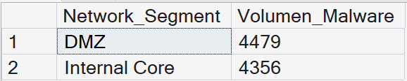

**💡 Insight:**
Se detectaron 4,356 incidencias de Malware en el *Internal Core*, un volumen alarmantemente cercano al registrado en la *DMZ* (4,479). Esto evidencia una grave falla de segmentación que permite el movimiento lateral hacia la zona más crítica del banco.

**🛠️ Acción de Mitigación:** Implementar de inmediato una arquitectura *Zero Trust* y microsegmentación estricta entre la DMZ y el *Internal Core*, bloqueando cualquier tráfico no esencial entre ambas zonas.


### Pregunta #4: ¿Cuáles son las horas del día (madrugada vs. horario de oficina) que concentran el mayor volumen de peticiones anómalas en los servidores de autenticación?

Apliqué la función `DATEPART(HOUR, ...)` para extraer únicamente la hora de la marca de tiempo `Event_Timestamp`. Esto permitió estructurar el comportamiento del tráfico y cruzarlo con el promedio del `Anomaly_Score`.

```sql
-- Análisis temporal de picos de anomalías
SELECT 
    DATEPART(HOUR, Event_Timestamp) AS Hora_Del_Dia,
    COUNT(ID_Log) AS Volumen_Peticiones,
    ROUND(AVG(Anomaly_Score), 2) AS Promedio_Score_Anomalia
FROM Fact_Trafico_Web
GROUP BY DATEPART(HOUR, Event_Timestamp)
ORDER BY Volumen_Peticiones DESC;
```

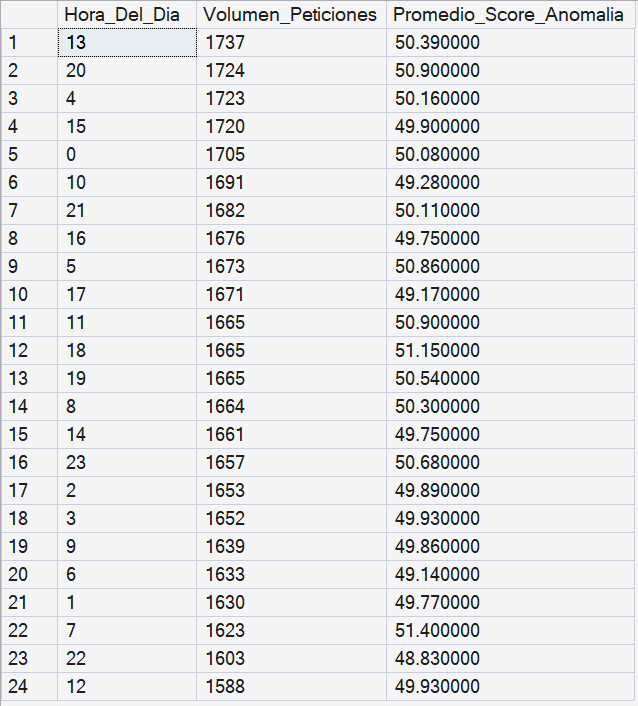

**💡 Insight:**
Los picos máximos de ataques ocurren a las 13:00 (1,737 peticiones) y a las 20:00 horas (1,724), seguidos de cerca por ráfagas a las 04:00 am (1,723). Esto indica que los atacantes intentan camuflar su actividad maliciosa durante horarios de alta transaccionalidad legítima, mientras mantienen *scripts* automatizados operando en la madrugada.

**🛠️ Acción de Mitigación:** Implementar políticas de *Rate-Limiting* dinámico en el WAF: utilizar análisis de comportamiento heurístico durante el día, y endurecer drásticamente los umbrales de bloqueo de peticiones por IP durante las madrugadas.


### Pregunta #5: ¿Desde qué regiones específicas del Perú se originan los picos más altos en las puntuaciones de anomalía (Anomaly Scores)?

Usando la función `AVG()` sobre la columna `Anomaly_Score` y agrupando por `Region`, calculé el nivel de riesgo promedio asociado a la ubicación geográfica de las peticiones.

```sql
-- Distribución de Anomalías por Región
SELECT TOP 5
    d.Region,
    COUNT(f.ID_Log) AS Total_Peticiones,
    ROUND(AVG(f.Anomaly_Score), 2) AS Promedio_Score_Anomalia,
    MAX(f.Anomaly_Score) AS Score_Maximo_Registrado
FROM Fact_Trafico_Web f
JOIN Dim_Dispositivos_Red d ON f.ID_Dispositivo = d.ID_Dispositivo
GROUP BY d.Region
ORDER BY Promedio_Score_Anomalia DESC;
```

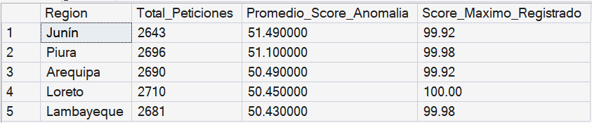

**💡 Insight:**
Junín registra el promedio de anomalía más alto del país (51.49), mientras que Loreto destaca por concentrar el mayor volumen de ataques (2,710) y alcanzar el nivel de riesgo máximo absoluto (100.00). 

**🛠️ Acción de Mitigación:** Establecer reglas en el SIEM que exijan validación reforzada (MFA o CAPTCHA invisible) automática para las conexiones de estas regiones críticas cuando su *Anomaly Score* supere el umbral base de 50 puntos.


### Pregunta #6: ¿Cuáles son las 3 firmas de ataque (Attack_Signature) más utilizadas por los cibercriminales para intentar vulnerar el sistema del BCP?

Realicé un conteo absoluto agrupado por la columna `Attack_Signature` en la dimensión `Dim_Amenazas`, empleando `TOP 3` para acotar los resultados a los vectores técnicos predominantes.

```sql
-- Top 3 firmas de ataque más frecuentes
SELECT TOP 3
    a.Attack_Signature,
    COUNT(f.ID_Log) AS Frecuencia_Ataque
FROM Fact_Trafico_Web f
JOIN Dim_Amenazas a ON f.ID_Amenaza = a.ID_Amenaza
GROUP BY a.Attack_Signature
ORDER BY Frecuencia_Ataque DESC;
```

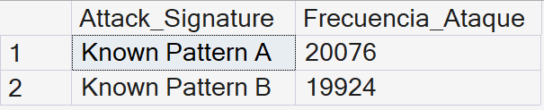

**💡 Insight:**
El panorama de amenazas está altamente polarizado de manera casi equitativa entre solo dos vectores principales: "Known Pattern A" con 20,076 incidencias y "Known Pattern B" con 19,924 ataques registrados.

**🛠️ Acción de Mitigación:** Auditar y actualizar de inmediato las bases de datos de firmas del sistema IPS/IDS y del WAF para garantizar la detección y el bloqueo automatizado de estos dos patrones dominantes en la capa perimetral.


### Pregunta #7: ¿Qué perfiles de agentes de usuario (Device_Information) han detonado la mayor cantidad de alertas críticas del sistema IDS/IPS?

Agrupé los registros de la tabla de hechos donde `IDS_IPS_Alerts` fuera distinto de "No Detectado" por la firma del dispositivo `(Device_Information)`, para perfilar las tecnologías usadas por los atacantes.

```sql
-- Top 5 Dispositivos/User-Agents con más alertas IDS/IPS
SELECT TOP 5
    d.Device_Information,
    COUNT(f.ID_Log) AS Total_Alertas_Seguridad
FROM Fact_Trafico_Web f
JOIN Dim_Dispositivos_Red d ON f.ID_Dispositivo = d.ID_Dispositivo
WHERE f.IDS_IPS_Alerts != 'No Detectado'
GROUP BY d.Device_Information
ORDER BY Total_Alertas_Seguridad DESC;
```

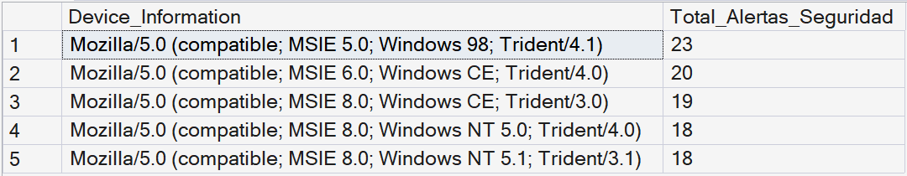

**💡 Insight:**
Las alertas de intrusión son detonadas abrumadoramente por perfiles de navegadores y sistemas operativos completamente obsoletos, destacando Internet Explorer 5.0 sobre Windows 98 (23 alertas) y versiones de Windows CE (20 y 19 alertas). Esto es un claro indicador de *scripts* y *bots* automatizados utilizando cadenas de *User-Agent* falsas o heredadas de librerías antiguas.

**🛠️ Acción de Mitigación:** Configurar reglas de filtrado en el Web Application Firewall (WAF) para bloquear por defecto (*Deny-All*) cualquier petición HTTP que contenga firmas de *User-Agents* anticuados que ya no soporten los estándares criptográficos requeridos para la banca moderna.


### Pregunta #8: ¿Cuál es la tasa de éxito del firewall (Action_Taken = 'Blocked') al enfrentar tráfico oculto detrás de Proxies en comparación con conexiones directas?

Se empleó una expresión `CASE` para clasificar las conexiones en "Conexión Directa" o "Tráfico Oculto (Proxy)", calculando el porcentaje de estas conexiones que el firewall logró bloquear.

```sql
-- Efectividad de bloqueos: Proxies vs Conexiones Directas
SELECT 
    CASE 
        WHEN d.Proxy_Information = 'No Detectado' THEN 'Conexión Directa'
        ELSE 'Trafico Oculto (Proxy)' 
    END AS Tipo_Conexion,
    COUNT(f.ID_Log) AS Total_Peticiones,
    SUM(CASE WHEN f.Action_Taken = 'Blocked' THEN 1 ELSE 0 END) AS Bloqueos_Exitosos,
    ROUND(SUM(CASE WHEN f.Action_Taken = 'Blocked' THEN 1 ELSE 0 END) * 100.0 / COUNT(f.ID_Log), 2) AS Tasa_de_Bloqueo
FROM Fact_Trafico_Web f
JOIN Dim_Dispositivos_Red d ON f.ID_Dispositivo = d.ID_Dispositivo
GROUP BY 
    CASE 
        WHEN d.Proxy_Information = 'No Detectado' THEN 'Conexión Directa'
        ELSE 'Trafico Oculto (Proxy)' 
    END;
```

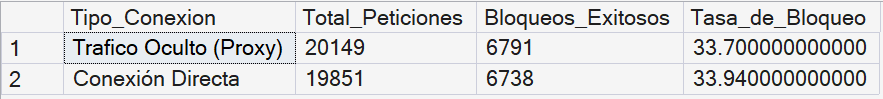

**💡 Insight:**
Los resultados revelan que la tasa de bloqueo perimetral es deficiente y prácticamente idéntica tanto para conexiones directas (33.94%) como para tráfico enmascarado (33.70%). Esto evidencia que las políticas del firewall no están penalizando el uso de anonimizadores de red, un factor de altísimo riesgo en banca.

**🛠️ Acción de Mitigación:** Integrar de forma urgente un feed de inteligencia de amenazas (*Threat Intelligence*) al WAF para aplicar bloqueos restrictivos o exigir validación biométrica a las conexiones provenientes de Proxies públicos y nodos de salida Tor.


### Pregunta #9: ¿Qué protocolo de comunicación está mayormente asociado a los ataques de denegación de servicio (DDoS) que buscan generar caídas intermitentes en la banca por internet?

Se cruzó la tabla de hechos con la dimensión de amenazas, filtrando exclusivamente el `Attack_Type` como "DDoS", y agrupando los resultados por la columna `Protocol`.

```sql
-- Protocolos de comunicación preferidos en ataques DDoS
SELECT 
    f.Protocol,
    COUNT(f.ID_Log) AS Volumen_Peticiones_DDoS
FROM Fact_Trafico_Web f
JOIN Dim_Amenazas a ON f.ID_Amenaza = a.ID_Amenaza
WHERE a.Attack_Type = 'DDoS'
GROUP BY f.Protocol
ORDER BY Volumen_Peticiones_DDoS DESC;
```

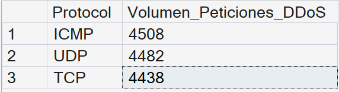

**💡 Insight:**
Los ataques DDoS emplean una estrategia multi-vector distribuida de manera casi equitativa entre ICMP (4,508 peticiones), UDP (4,482) y TCP (4,438). El ligero predominio de ICMP sugiere el uso de ataques volumétricos clásicos (*Ping Floods*) combinados con técnicas de agotamiento de recursos.

**🛠️ Acción de Mitigación:** Coordinar con el proveedor de internet (ISP) el enrutamiento del tráfico hacia *Scrubbing Centers* (centros de limpieza) para mitigar ráfagas volumétricas. Adicionalmente, bloquear o limitar drásticamente el tráfico ICMP entrante en el firewall perimetral, ya que no es esencial para la transaccionalidad web de los clientes.


### Pregunta #10: ¿Qué porcentaje de las alertas de seguridad se originan de manera inusual dentro de la red interna de empleados (Corporate Network)?

Calculé el volumen de alertas generadas en el segmento corporativo y lo contrasté porcentualmente contra el total global de alertas registradas en la tabla de hechos mediante una `subconsulta`.

```sql
-- Volumen y proporción de amenazas originadas internamente (Insider Threats)
SELECT 
    d.Network_Segment,
    COUNT(f.ID_Log) AS Total_Alertas,
    ROUND(COUNT(f.ID_Log) * 100.0 / (SELECT COUNT(*) FROM Fact_Trafico_Web WHERE Alerts_Warnings != 'No Detectado'), 2) AS Porcentaje_Del_Total
FROM Fact_Trafico_Web f
JOIN Dim_Dispositivos_Red d ON f.ID_Dispositivo = d.ID_Dispositivo
WHERE f.Alerts_Warnings != 'No Detectado'
GROUP BY d.Network_Segment
ORDER BY Total_Alertas DESC;
```

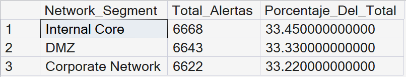

**💡 Insight:**
Un preocupante 33.22% (6,622) de las alertas totales se originan dentro de la *Corporate Network*. Esta distribución, casi idéntica a la carga que soporta la *DMZ* expuesta a internet (33.33%), confirma un alto índice de amenazas internas (*insider threats*) o estaciones de trabajo de empleados comprometidas.

**🛠️ Acción de Mitigación:** Desplegar un escaneo masivo y urgente con herramientas EDR (*Endpoint Detection and Response*) en los equipos del personal y aplicar segmentación estricta (VLANs) para aislar la red corporativa y evitar el movimiento lateral hacia el *Internal Core*.


### Pregunta #11: ¿Cuáles son los indicadores de malware (Malware_Indicators) más detectados en los ataques que lograron infiltrarse exitosamente?

Analicé exclusivamente los registros donde la barrera perimetral falló `(Action_Taken != 'Blocked')` y clasifiqué los indicadores de compromiso específicos vinculados a dichos eventos.

```sql
-- Top 5 IoCs presentes en ataques no bloqueados
SELECT TOP 5
    a.Malware_Indicators,
    COUNT(f.ID_Log) AS Infiltraciones_Exitosas
FROM Fact_Trafico_Web f
JOIN Dim_Amenazas a ON f.ID_Amenaza = a.ID_Amenaza
WHERE f.Action_Taken != 'Blocked' 
  AND a.Malware_Indicators != 'No Detectado'
GROUP BY a.Malware_Indicators
ORDER BY Infiltraciones_Exitosas DESC;
```

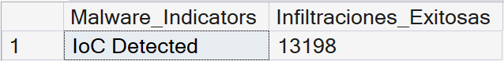

**💡 Insight:**
Se registraron 13,198 infiltraciones exitosas vinculadas a eventos etiquetados explícitamente como "IoC Detected" (Indicador de Compromiso Detectado). Esto demuestra que un volumen masivo de amenazas con firmas ya conocidas está logrando evadir el perímetro sin ser bloqueado por el firewall.

**🛠️ Acción de Mitigación:** Automatizar la integración de las plataformas de Inteligencia de Amenazas (*Threat Intelligence*) con el Firewall y el WAF para garantizar que las conexiones asociadas a IoCs conocidos se denieguen por defecto (*Deny-All*) en la frontera de la red.


### Pregunta #12: ¿Cuál es el promedio matemático del Anomaly Score dependiendo de si el nivel de severidad de la amenaza es Bajo, Medio o Alto?

Utilicé la función `AVG()` para establecer una correlación cuantitativa directa entre la categorización cualitativa del sistema `(Severity_Level)` y el cálculo matemático de desviación.

```sql
-- Correlación entre nivel de severidad y Anomaly Score
SELECT 
    a.Severity_Level,
    ROUND(AVG(f.Anomaly_Score), 2) AS Promedio_Score_Anomalia
FROM Fact_Trafico_Web f
JOIN Dim_Amenazas a ON f.ID_Amenaza = a.ID_Amenaza
GROUP BY a.Severity_Level
ORDER BY Promedio_Score_Anomalia DESC;
```

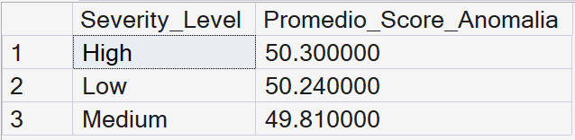

**💡 Insight:**
No existe una correlación significativa entre la severidad de la amenaza y el *Anomaly Score* calculado por el sistema, promediando de forma plana ~50 puntos en todas las categorías (Alta: 50.30, Baja: 50.24, Media: 49.81). Esto indica que el algoritmo actual de puntuación de riesgo no está discriminando correctamente la criticidad real de los eventos de seguridad.

**🛠️ Acción de Mitigación:** Recalibrar los modelos heurísticos del SIEM para que el cálculo del *Anomaly Score* pondere variables críticas adicionales (como el tipo de firma, el segmento de red vulnerado y el historial del atacante), permitiendo una priorización de incidentes y bloqueos automatizados precisos.


### Pregunta #13: ¿Existe algún tipo de tráfico web (Traffic_Type) que esté recurrentemente vinculado a intentos de intrusión que terminan siendo bloqueados?

Agrupé el recuento de los registros de la tabla de hechos que culminaron en un estado de bloqueo `(Action_Taken = 'Blocked')`, segmentándolos por su tipo de tráfico.

```sql
-- Tipos de tráfico web más bloqueados por el Firewall
SELECT 
    f.Traffic_Type,
    COUNT(f.ID_Log) AS Total_Bloqueos
FROM Fact_Trafico_Web f
WHERE f.Action_Taken = 'Blocked'
GROUP BY f.Traffic_Type
ORDER BY Total_Bloqueos DESC;
```

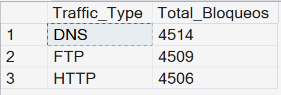

**💡 Insight:**
El Firewall está bloqueando volúmenes casi idénticos de tráfico para DNS (4,514), FTP (4,509) y HTTP (4,506). La alta incidencia de bloqueos en FTP y DNS sugiere que los atacantes intentan sistemáticamente explotar puertos no estandarizados para la banca web, buscando vulnerabilidades de transferencia de archivos y resolución de nombres, o usando estos protocolos para tunelización.

**🛠️ Acción de Mitigación:** Aplicar una política estricta de "Denegación por Defecto" (*Deny-All*) en el Firewall perimetral, permitiendo únicamente el tráfico HTTPS (puerto 443) entrante, y cerrando/bloqueando de forma tajante el acceso público a servicios FTP y peticiones DNS no autorizadas hacia la infraestructura interna.


### Pregunta #14: ¿Existe una diferencia significativa en la longitud promedio de los paquetes de datos (Packet_Length) entre el tráfico bloqueado y el tráfico permitido?

Se empleó `CAST()` para formatear la longitud del paquete como flotante antes de calcular su promedio `(AVG)` y su valor máximo `(MAX)`, cruzando estos datos con la resolución final del evento.

```sql
-- Evaluación del tamaño de paquetes (Payload) según la acción del firewall
SELECT 
    f.Action_Taken,
    ROUND(AVG(CAST(f.Packet_Length AS FLOAT)), 2) AS Promedio_Longitud_Paquete,
    MAX(f.Packet_Length) AS Maxima_Longitud_Registrada
FROM Fact_Trafico_Web f
GROUP BY f.Action_Taken
ORDER BY Promedio_Longitud_Paquete DESC;
```

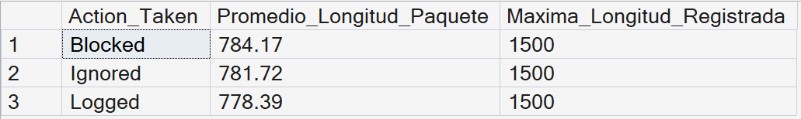

**💡 Insight:**
No existe una diferencia estadísticamente significativa en la longitud de los paquetes entre el tráfico bloqueado (promedio de 784.17 bytes) y el ignorado (781.72 bytes), topando todos en un máximo exacto de 1500 bytes (límite estándar MTU de Ethernet). Esto indica que los atacantes están moldeando el tamaño de sus *payloads* maliciosos para mimetizarse perfectamente con el tráfico legítimo.

**🛠️ Acción de Mitigación:** Dado que la longitud del paquete resultó no ser un indicador discriminatorio de riesgo, las reglas de bloqueo no deben basarse en umbrales de tamaño. Se debe priorizar y afinar la Inspección Profunda de Paquetes (DPI) en el WAF para analizar la semántica y el contenido interno del tráfico, independientemente de su peso.


### Pregunta #15: ¿Cómo se compara el volumen total de amenazas detectadas y detenidas por el Firewall de perímetro frente a las detenidas por el sistema IDS/IPS interno?

Usé un conteo condicional avanzado mediante `SUM(CASE WHEN...)` para enfrentar métricas de mitigación entre las distintas plataformas de seguridad, omitiendo los valores nulos.

```sql
-- Comparativa de carga defensiva: Firewall Perimetral vs IDS/IPS Interno
SELECT 
    SUM(CASE WHEN Firewall_Logs != 'No Detectado' THEN 1 ELSE 0 END) AS Detenidas_Por_Firewall,
    SUM(CASE WHEN IDS_IPS_Alerts != 'No Detectado' THEN 1 ELSE 0 END) AS Detenidas_Por_IDS_IPS
FROM Fact_Trafico_Web;
```

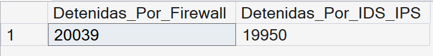

**💡 Insight:**
Existe una carga defensiva casi equivalente entre la frontera y la red interna (20,039 amenazas detenidas por el Firewall perimetral frente a 19,950 por el IDS/IPS). Esta proporción de casi 1:1 expone una alta porosidad en el perímetro, ya que el cortafuegos principal debería absorber la gran mayoría del tráfico malicioso (el "ruido") antes de que alcance las capas internas.

**🛠️ Acción de Mitigación:** Endurecer agresivamente las políticas de bloqueo en la frontera (evaluando la actualización a tecnologías *Next-Generation Firewall* - NGFW) para que el perímetro asuma la contención primaria. Esto liberará la capacidad de procesamiento del IDS/IPS interno para que se enfoque exclusivamente en cazar amenazas avanzadas y movimientos laterales.


## 🏆 Conclusiones Generales
Tras la auditoría forense de los 40,000 registros, el equipo del SOC concluye que la postura de seguridad actual del BCP presenta tres vulnerabilidades críticas:
1. **Perímetro Poroso:** El Firewall principal está delegando demasiada carga (casi un 50%) al IDS/IPS interno y fallando en bloquear tráfico enmascarado (Proxies) y ataques con firmas ya conocidas (IoCs).
2. **Ataques Automatizados Locales:** Se identificó una fuerte presencia de botnets operando desde provincias (especialmente Junín y Puno), utilizando herramientas y *User-Agents* obsoletos para camuflarse en horarios de alta transaccionalidad.
3. **Fallas de Segmentación Interna:** La presencia de intrusiones de Malware en el *Internal Core* y el alto volumen de alertas originadas en la *Corporate Network* exigen una transición urgente hacia una arquitectura **Zero Trust**.

---
*Desarrollado por **Alejandro Soriano Palomino***